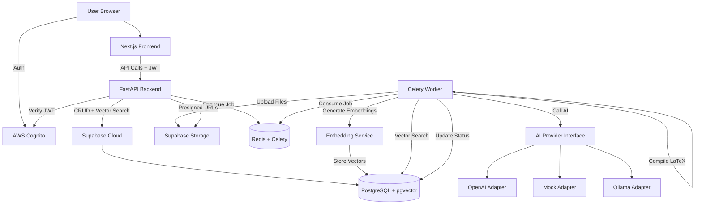

# Architecture Documentation

## System Architecture

## Data Flow

### Resume Generation Flow

1. **User Authentication**
   - User logs in via AWS Cognito Hosted UI
   - Frontend receives JWT access token
   - Token stored in httpOnly cookie

2. **Profile Data Entry**
   - User creates/updates profile, education, experience, projects, skills
   - Backend validates and stores in Supabase
   - Contact fields encrypted before storage

3. **Job Description Input**
   - User pastes or selects job description
   - Backend saves JD and enqueues embedding generation
   - Worker generates embedding using OpenAI/sentence-transformers
   - Embedding stored in pgvector column

4. **Resume Generation Request**
   - User submits generation request with:
     - Profile ID
     - Job description (text or ID)
     - Page count (1-3)
     - Output formats (PDF, LaTeX, DOCX)
   - Backend snapshots all profile data
   - Creates `generated_resume` record with status=QUEUED
   - Enqueues Celery task

5. **Worker Processing**
   - Worker fetches generated_resume record
   - Updates status to RUNNING
   - Generates JD embedding if missing
   - Vector search for relevant experiences/projects
   - Calls AI provider with:
     - Profile snapshot
     - Job description
     - Vector-selected relevant content
     - Page count constraints
   - AI returns selected and optimized content (JSON)
   - Validates and repairs AI output
   - Performs factuality check
   - Renders LaTeX template with Jinja2
   - Escapes all user content for LaTeX
   - Compiles PDF using Tectonic
   - Generates DOCX (if requested)
   - Uploads files to Supabase Storage
   - Stores file records with storage keys
   - Updates status to DONE or FAILED

6. **File Download**
   - User polls status endpoint
   - On DONE, fetches file list
   - Backend generates presigned URLs (1 hour validity)
   - User downloads files

## Security Model

### Authentication

- **AWS Cognito JWT Validation**
  - Backend validates JWT via JWKS endpoint
  - Extracts `sub` claim as `user_id`
  - All protected endpoints require valid JWT
  - Dev bypass available for local development (disabled by default)

### Authorization

- **Row-Level Ownership**
  - Every database query filters by `user_id`
  - Prevents IDOR (Insecure Direct Object Reference) vulnerabilities
  - Enforced at service layer

### Data Protection

- **Encrypted Contact Fields**
  - AES-256-GCM encryption for sensitive contact info
  - Encryption key from environment variable
  - Supports key versioning for rotation

- **Log Redaction**
  - Never log PII or full job descriptions
  - Audit logs store minimal metadata

### Rate Limiting

- **API Rate Limits**
  - 100 requests/minute per IP (general endpoints)
  - 10 generate requests/hour per user (generation endpoint)
  - Implemented with slowapi

### Input Validation

- **Pydantic Schemas**
  - All API requests validated with Pydantic
  - Type checking and constraint validation
  - Automatic error responses

## AI Design

### Provider Interface

Abstract `AIProvider` interface with implementations:
- **OpenAIAdapter**: Uses GPT-4o with JSON mode
- **MockAdapter**: Returns deterministic JSON (for tests/CI)
- **OllamaAdapter**: Calls local Ollama API

### Content Selection

AI receives:
- Full profile snapshot
- Job description
- Vector-selected relevant content (pre-filtered)
- Page count constraints
- Section inclusion flags

AI returns:
- Selected education entries
- Selected experience entries with rewritten bullets
- Selected projects with rewritten bullets
- Selected skills

### Factuality Guarantees

- AI prompt explicitly forbids hallucination
- Post-processing factuality check
- Cross-references AI output with original profile
- Removes or flags invalid content

### No Training Required

- Uses general-purpose LLM (GPT-4o)
- Inference-only, no fine-tuning
- Prompt engineering for task-specific behavior

## Vector Database

### pgvector Integration

- **Extension**: pgvector in Supabase PostgreSQL
- **Embedding Dimensions**: 1536 (OpenAI text-embedding-3-small)
- **Index Type**: IVFFlat with cosine similarity

### Embeddings Generated For

- Job descriptions (stored in `job_description.embedding`)
- Experience bullets (stored in `experience_bullet.embedding`)
- Project bullets (stored in `project_bullet.embedding`)

### Vector Search Use Cases

1. **Find Relevant Experiences**
   - Query: Job description embedding
   - Returns: Top N experience bullets by cosine similarity
   - Helps AI prioritize most relevant content

2. **Find Relevant Projects**
   - Query: Job description embedding
   - Returns: Top N project bullets by cosine similarity

3. **Find Similar Job Descriptions**
   - Query: Job description embedding
   - Returns: Similar JDs user has seen
   - Helps user discover patterns

## LaTeX Rendering

### Template System

- **Base Template**: Jake's Resume `resume.cls` (vendored)
- **Jinja2 Template**: `template.tex.jinja2`
- **Rendering**: Jinja2 fills template with data
- **Escaping**: All user content LaTeX-escaped

### Deterministic Output

- Same input JSON → same .tex output
- No randomness in template rendering
- Ensures reproducible results

### PDF Compilation

- **Tool**: Tectonic (modern LaTeX engine)
- **Sandbox**: No shell escape, 30-second timeout
- **Output**: PDF bytes stored in memory
- **Error Handling**: Failures logged, job marked as FAILED

## Database Schema

See `docs/schema.sql` for complete DDL.

### Key Tables

- `app_user`: User accounts (linked to Cognito)
- `profile`: User profiles
- `profile_contact`: Encrypted contact information
- `education`, `experience`, `project`, `skill_category`: Resume content
- `job_description`: Job descriptions with embeddings
- `generated_resume`: Generation requests and status
- `generated_file`: Generated files with storage keys
- `resume_template`: Template definitions

### Vector Columns

- `job_description.embedding`: vector(1536)
- `experience_bullet.embedding`: vector(1536)
- `project_bullet.embedding`: vector(1536)

All indexed with IVFFlat for fast similarity search.

## Deployment Architecture

### Production Components

- **Frontend**: Vercel/Netlify (Next.js)
- **Backend**: AWS ECS / Google Cloud Run / Railway (FastAPI)
- **Worker**: Same infrastructure as backend (Celery)
- **Database**: Supabase Cloud (managed PostgreSQL)
- **Storage**: Supabase Storage (S3-compatible)
- **Cache/Queue**: Redis Cloud / AWS ElastiCache
- **Auth**: AWS Cognito

### Environment Variables

Production requires:
- Supabase production credentials
- AWS Cognito configuration
- OpenAI API key (or other AI provider)
- Encryption key (stored securely)
- Redis connection string

### Monitoring

- **Error Tracking**: Sentry
- **Metrics**: CloudWatch / Datadog
- **Logs**: Centralized logging service
- **Health Checks**: `/health` endpoint

## Scalability Considerations

### Database

- Connection pooling (Supabase pooler)
- Read replicas for heavy read workloads
- Index optimization for vector searches

### Worker

- Horizontal scaling (multiple Celery workers)
- Task prioritization
- Retry logic for transient failures

### Storage

- Supabase Storage scales automatically
- Presigned URLs reduce backend load
- CDN for file delivery (optional)

## Future Enhancements

- **Hugging Face Integration**: vLLM or Ollama adapter for open-source models
- **Real-time Updates**: WebSocket for generation progress
- **Template Marketplace**: User-contributed templates
- **Batch Generation**: Generate multiple resumes at once
- **Analytics**: Track generation success rates, popular templates

